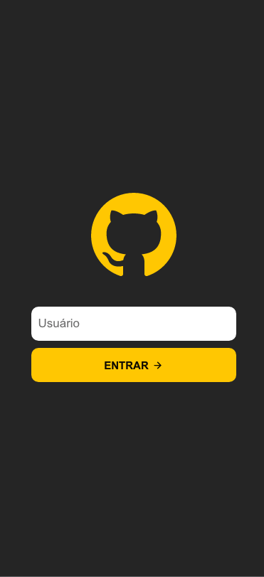
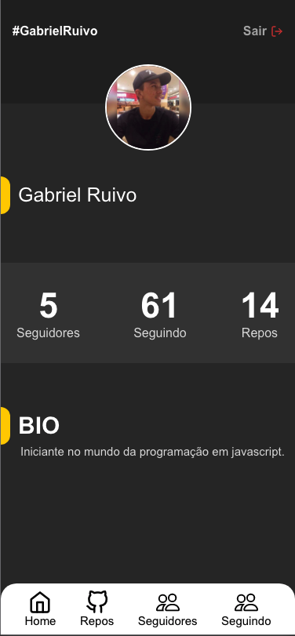
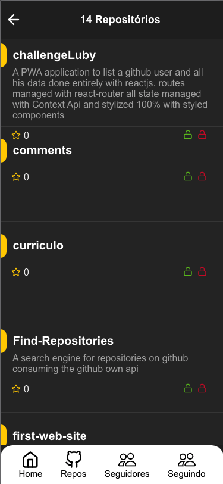
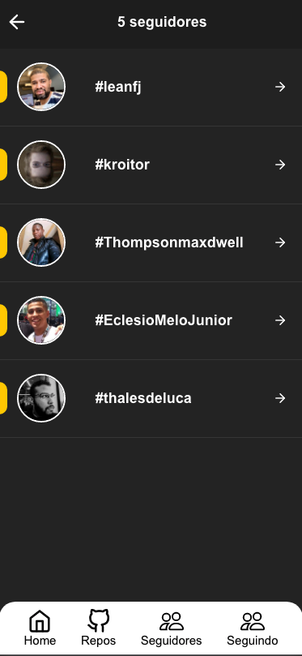
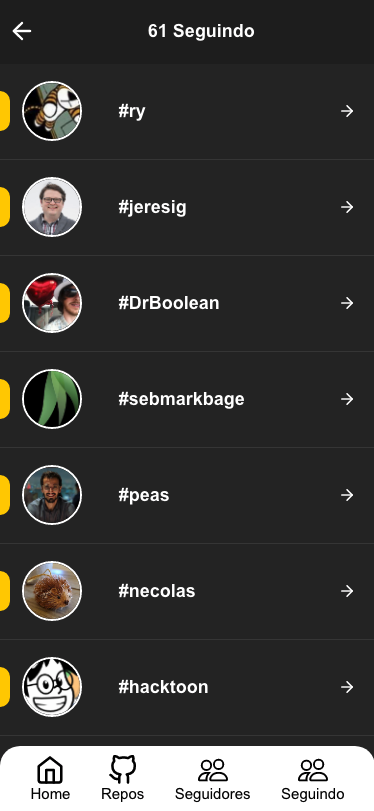

# Github search engine

You can see my application working at this link: <a href="https://stupefied-golick-5d9091.netlify.app/" target="_blank" >Here</a>
 

  

    
    
  

  

    
    
  

  

    
    
  

## 🤓 Technologies 

This project was developed using the following techs:

- ✅ REACTJS (REACT HOOK).
  - ✅ Styled Components.
  - ✅ Context API.

## Available Scripts
In the project directory, you can run:

### `yarn start`

Runs the app in the development mode. 
Open [http://localhost:3000](http://localhost:3000) to view it in the browser.

The page will reload if you make edits. 
You will also see any lint errors in the console.